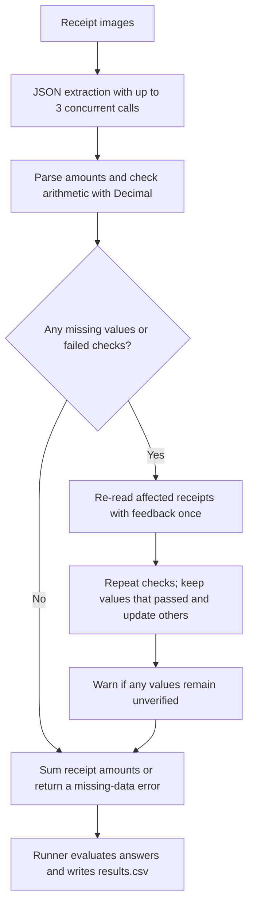

# FTEC5660 Homework 1: Receipt Chain

Build a LangChain pipeline that reads every supermarket receipt in a folder
with the vision-capable DeepSeek Flash model and answers these two questions:

1. How much money did I spend in total for these bills?
2. How much would I have had to pay without the discount?

For this homework, **amount spent** means the final payment after the receipt's
rounding line. **Without the discount** means the sum of the original positive
item prices: add back every promotion, coupon, member, app, packaging-damage,
and percentage discount, but do not add back rounding.

## Student task

Only edit the two functions in `hw1.py` that contain `### YOUR CODE HERE`:

- `build_chain()` creates your LangChain chain.
- `answer_queries()` runs the chain on the receipt images and returns one final
  response for each question.

You may use prompt chaining, routing, parallel calls, reflection, or a
combination. Your final responses should each contain one HKD amount. Do not
hard-code filenames or public answers; grading uses unseen receipt folders.

## Setup and public test

```bash
python3 -m venv .venv
source .venv/bin/activate
pip install -r requirements.txt
```

Put your DeepSeek key after `DEEPSEEK_API_KEY=` in `.env`, then run:

```bash
python3 hw1.py --image-folder public_test
```

The program creates `results.csv` in the current directory. Its columns are
`query`, `model_response`, and `correctness`. The public answers are in
`public_test/ground_truth.json`. The starter intentionally returns the dummy
response `please design your chain to answer these two queries.` so it runs
before you add any API code.

The required model is `deepseek-v4-flash-vision-exp`, the vision-capable
DeepSeek Flash model. JPEG, PNG, GIF, and WebP inputs are accepted by the
homework runner.


## Homework 1 solution



The solution combines parallel extraction, conditional review, and Python arithmetic through a LangChain pipeline: `ChatPromptTemplate → ChatDeepSeek → StrOutputParser`. It uses `deepseek-v4-flash-vision-exp` with JSON output, thinking disabled, and temperature `0`. Each receipt is extracted into `paid`, `subtotal`, `rounding`, `items`, and `discounts`, with at most three concurrent requests. Python validates monetary values and performs calculations with `Decimal`. For each receipt, Question 1 uses the final payment, falling back to `subtotal + rounding` when `paid` is absent or null. Question 2 uses the subtotal plus the absolute amounts of all applied discounts, excluding rounding. Arithmetic checks compare the payment with `subtotal + rounding` and the Question 2 amount with the sum of item and fee amounts. Only receipts with missing values or failed checks receive one additional extraction with feedback; values that already passed their checks are retained while other values are updated. There are at most two extraction rounds, separate from the configured API retry. If checks remain unresolved but all required values are available, the program prints a warning and still includes those values in the totals. If a required value is missing, the affected question returns `ERROR: receipt data could not be read`. The provided runner evaluates the completed answers and writes `results.csv`; public ground truth is used for scoring after inference. The solution functions contain no hard-coded receipt filenames or expected answers. These checks establish arithmetic consistency, not guaranteed image-recognition accuracy.
